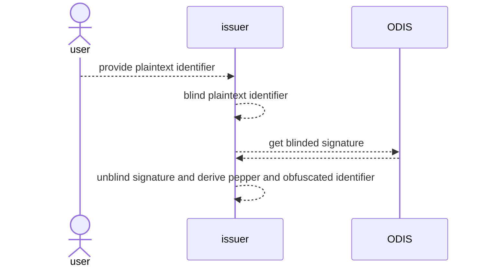
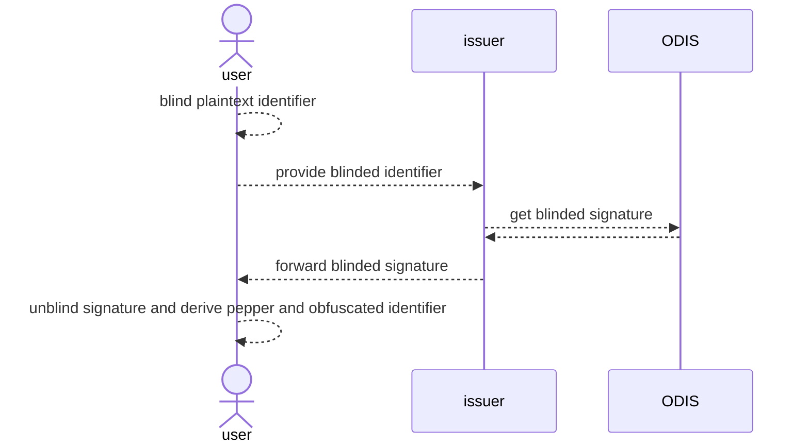

# Attestations Privacy

Identifiers are obfuscated to preserve the privacy of on-chain attestations. This is done by hashing over the identifier and a secret pepper. Directly using the hash of just the identifier is avoided, as attackers could still discover attestation mappings via a [rainbow table attack](https://wikipedia.org/wiki/Rainbow_table).

The secret pepper used for obfuscation is obtained through the [Oblivious Decentralized Identifier Service (ODIS)](https://docs.celo.org/protocol/identity/odis). Standardizing the pepper is necessary for interoperability, so that clients can discover each others attestations. Peppers produced by ODIS are cryptographically strong, and so cannot be guessed in a brute force or rainbow table attack. ODIS also imposes a rate limit to prevent attackers from scanning a large number of identifiers. Aside from privacy-preserving identifier attestions, ODIS can also be used for other use cases, such as [account recovery](https://docs.celo.org/protocol/identity/encrypted-cloud-backup).
## Table of contents

  - [Obfuscated Identifier Derivation](#obfuscated-identifier-derivation)
    - [Identifier Types and Prefixes](#identifier-types-and-prefixes)
    - [Blinding](#blinding)
  - [Using the SDK](#using-the-sdk)
    - [Rate Limit](#rate-limit)
    - [Authentication](#authentication)
    - [Service Context](#service-context)
    - [Runtime Environments](#runtime-environments)
      - [Node](#node)
      - [React Native](#react-native)
      - [Web](#web)

## Obfuscated Identifier Derivation

Below describes the steps to derive the *obfuscated identifier*, which is publicly used in on-chain attestations, starting with the *plaintext identifier*, which is privately known.

| Variables | Derivation|
| -- | -- |
|**plaintext identifier**| Off-chain information, ex: phone number, twitter handle, email, etc.|
|**identifier prefix**| A string that states the type of the identifier |
|**blinded identifier**| Obtained by using the [threshold BLS library](https://github.com/celo-org/celo-threshold-bls-rs) to blind over the *prefix* and *plaintext identifier*, which are appended like `{prefix}://{plaintextIdentifier}`. For backwards compatibility with ASv1, identifiers that are phone numbers are directly blinded without the prefix.|
|**blinded signature**| The *blinded identifier* is sent to ODIS, which signs it and returns a signature|
|**unblinded signature**| Obtained by unblinding the *blinded signature*|
|**pepper**| Unique secret, obtained by taking the first 13 characters of the sha256 hash of the *unblinded signature*|
|**obfuscated identifier**| Identifier used for on-chain attestations, obtained by hashing the *plaintext identifier*, *identifier prefix*, and *pepper* using this schema: `sha3(sha3({prefix}://{plaintextIdentifier})__{pepper})`. For backwards compatibility, identifiers that are phone numbers use this schema: `sha3({prefix}://{plaintextIdentifier}__{pepper})`|

You can see these steps implemented in the `@celo/identity` sdk [here](https://github.com/celo-org/celo-monorepo/blob/master/packages/sdk/identity/src/odis/identifier.ts).

Here is a concrete example:

- **Alice's phone number**: `+12345678901`
- The ODIS pepper for Alice's phone number: `SqXDxoTdBpKH2` 
- The obfuscation pattern: `sha3({prefix}://{plaintextIdentifier}__{pepper})`
- The actual obfuscation: `sha3('tel://+123456789__SqXDxoTdBpKH2')` = `0x8b578f2053a41113066b8410ca2d952a27b5f4531838ff54ca68e7c5cc7caf47`
- **Alice's obfuscated phone number**: `0x8b578f2053a41113066b8410ca2d952a27b5f4531838ff54ca68e7c5cc7caf47`

### Identifier Types and Prefixes

Each identifier type has a corresponding prefix that is appended before the blinding and hashing. This prevents identifiers from different sources from having the same pepper (ie. if you have the same handle for twitter and instagram, the obfuscated identifier should be different for each).

These are the prefixes currently defined in the SDK. We are using [DID methods](https://w3c.github.io/did-spec-registries/#did-methods) as prefixes when they exist. We welcome PRs here and [in the SDK](https://github.com/celo-org/celo-monorepo/blob/master/packages/sdk/identity/src/odis/identifier.ts#L27-L34) if you'd like to add a new identifier type and prefix! You can also cast an arbitrary string as your prefix if you would like.

| Type | Prefix |  
|---------|--------|
| Phone numbers | `tel` |
| Twitter handles | `twit` |
| Email addresses | `mailto` |

<!-- | Identifiers | Obfuscation patterns  | Obfuscation examples |
|------|--------|--------|
| **Phone numbers** | `sha3({prefix}{e164_phone_number}{separator}{ODIS_pepper})` | `sha3(tel://+123456789__123abc)` = c1fbb1429e94...a9509df3f1a |
| **Twitter accounts** | `sha3({prefix}{twitter_handle}{separator}{ODIS_pepper})`  | `sha3(twitter://@CeloOrg__456def)` = 96fdf5e45259f7...760502dba1709 |
| **Email addresses** | `sha3({prefix}{email_address}{separator}{ODIS_pepper})` | `sha3(email://hello@celo.org__789ghi)` = 4b2b6074417fe4d6...2cc6b16aa8c |
| **Reddit accounts** | `sha3({prefix}{reddit_handle}{separator}{ODIS_pepper})` | `sha3(reddit://@celoorg__321jkl)` = bb29224bc50afb46d20...bdfdcb9831abb |
| **Keybase accounts** | `sha3({prefix}{keybase_handle}{separator}{ODIS_pepper})` | `sha3(keybase://@celoorg__759mno)` = ccee4144e17dcac2f...f17ba805032974 |
| **More** | ... | ... | -->

<!-- You can [visualise sha3 hashes online here](https://emn178.github.io/online-tools/sha3_256.html) if you prefer learning by doing. -->

### Blinding

Identifiers are blinded with a secret blinding factor before they are sent to ODIS to ensure the privacy of user personal information. ODIS operators aren't privy to what information they are signing or what the result is being used for. The beauty of BLS signatures is that the final unblinded signature is the *same* result that would have been achieved if ODIS had directly signed the unblinded plaintext identifier.

In most cases, the issuer will be performing the blinding, unblinding, and obfuscated identifier derivation, as they will also then be performing attestation registration, lookups and revocation.
<details>
<summary><i>Issuer-side blinding</i></summary>


</details>

However, for extra privacy, the user can also blind the identifier before they share it with the issuer, and also perform the unblinding and obfuscated identifier derivation themselves. The user can perform registration and revocation of attestations themselves, but would need to pass the obfuscated identifier back to the issuer for registration

<details>
<summary><i>User-side blinding</i></summary>


</details>

## Using the SDK

The [`@celo/identity`](https://www.npmjs.com/package/@celo/identity) package is an SDK that provides useful helper functions to handle querying ODIS and deriving the obfuscated identifier.

> ❗️ Make sure you are using version `3.0.1` or later

Import the `OdisUtils` module into your project for all relevant functions
```typescript
import { OdisUtils } from "@celo/identity";
```

-------------
The most important function is `getObfuscatedIdentifier`, which completes the entire process of obfuscated identifier derivation, starting from the plaintext identifier.

#### Parameters:

|Parameter | Type | Description |
|------ | ------ | ----------------------- |
`plaintextIdentifier` | string | plaintext identifier to be obfuscated
`identifierPrefix`| IdentifierPrefix | you can use a predefined type on the `IdentifierPrefix` enum or you can cast an arbitrary string
`account` | string | account making the ODIS query that quota will be deducted from, see [Rate Limit](#rate-limit)
`signer` | AuthSigner | object describing the authentication method and providing authentication key, see [Authentication](#authentication)
`context` | ServiceContext | object providing the ODIS context, see [Service Context](#service-context)
`blindingFactor` (optional) | string | secret seed used for blinding/unblinding the identifier, by default a one-time random seed is used in the blinding client
`clientVersion` (optional) | string | 
`blsBlindingClient` (optional) | BlsBlindingClient | the default blinding client used only works server-side, see [Runtime Environments](#runtime-environments) for alternatives
`sessionID` (optional) | string | 
`keyVersion` (optional) | number | 
`endpoint` (optional) | | 

#### Returns: 
`Promise‹IdentifierHashDetails›`

```typescript
interface IdentifierHashDetails {
  plaintextIdentifier: string
  obfuscatedIdentifier: string
  pepper: string
  unblindedSignature: string
}
```

#### Example:

```typescript
import { OdisUtils } from "@celo/identity";

await OdisUtils.Identifier.getObfuscatedIdentifier(
  '+12345678910',
  OdisUtils.Identifier.IdentifierPrefix.PHONE_NUMBER,
  issuerAddress,
  authSigner,
  serviceContext
)
// {
//   plaintextIdentifier: '+12345678910',
//   obfuscatedIdentifier: 'c1fbb1429e94f4...3f1a',
//   pepper: '123abc',
//   unblindedSignature: '9as8duf98as...df80u'
// }
```
*Source code for `getObfuscatedIdentifier` and other relevant functions [here](https://github.com/celo-org/celo-monorepo/blob/master/packages/sdk/identity/src/odis/identifier.ts)*

-------------

### Rate Limit

ODIS implements rate limiting on queries to prevent brute force attackers. Every account interacting with ODIS has a quota for the number of queries it can make.

You can check how much quota is left on your account:

```typescript
const { remainingQuota } = await OdisUtils.Quota.getPnpQuotaStatus(
  address,
  authSigner,
  serviceContext
);
```

You can increase the quota on your account by making a payment to the [`OdisPayments` contract](https://github.com/celo-org/celo-monorepo/blob/master/packages/protocol/contracts/identity/OdisPayments.sol). The cost per quota is 0.001 cUSD.

```ts
if (remainingQuota < 1) {
  const stableTokenContract = await kit.contracts.getStableToken();
  const odisPaymentsContract = await kit.contracts.getOdisPayments();
  const ONE_CENT_CUSD_WEI = 10000000000000000
  await stableTokenContract
    .increaseAllowance(odisPaymentsContract.address, ONE_CENT_CUSD_WEI)
    .sendAndWaitForReceipt();
  const odisPayment = await odisPaymentsContract
    .payInCUSD(this.issuer.address, ONE_CENT_CUSD_WEI)
    .sendAndWaitForReceipt();
}
```

### Authentication

There are two authentication methods for your `AuthSigner` when interacting with ODIS:

1. **`WalletKeySigner`**:  uses a wallet key by passing in a contractkit instance with the account unlocked:

    ```typescript
    const authSigner: AuthSigner = {
      authenticationMethod: OdisUtils.Query.AuthenticationMethod.WALLET_KEY,
      contractKit,
    };
    ```

2. **`EncryptionKeySigner`**: uses the [data encryption key (DEK)](https://docs.celo.org/developer/contractkit/data-encryption-key) by passing in the raw private key.

    The DEK is a key pair specifically used for signing data. It must be [registered to your account](https://github.com/celo-org/celo-monorepo/blob/0aea63826f8c7e7d2f3fe0c32eb314471e2c2f33/packages/protocol/contracts/common/Accounts.sol#L244) before it is used.

    ```ts
    accountsContract.setAccountDataEncryptionKey(DEK_PUBLIC_KEY).send({from: issuerAddress})
    ```

    Any key pair can be used as a DEK, but [this](https://github.com/celo-org/celo-monorepo/blob/0aea63826f8c7e7d2f3fe0c32eb314471e2c2f33/packages/sdk/cryptographic-utils/src/dataEncryptionKey.ts#L36-L54) or [this](https://github.com/celo-org/celo-monorepo/blob/0aea63826f8c7e7d2f3fe0c32eb314471e2c2f33/packages/sdk/cryptographic-utils/src/account.ts#L440-L459) function in [`@celo/cryptographic-utils`](https://www.npmjs.com/package/@celo/cryptographic-utils) can be used to generate the DEK. Or, using a private key, you can get the compressed public key using [ethers Signing Key](https://docs.ethers.org/v5/api/utils/signing-key/).

    The `EncryptionKeySigner` authentication method is preferred, since it doesn't require the user to access the wallet key that manages their funds. Also, when using the DEK for authentication, ODIS will also use the DEK as the blinding factor, so that ODIS identifies repeat queries and doesn’t charge additional quota. The tradeoff is that the extra computation when using the DEK can add a tiny bit of latency.

    ```typescript
    const authSigner: AuthSigner = {
      authenticationMethod: OdisUtils.Query.AuthenticationMethod.ENCRYPTION_KEY,
      rawKey: privateDataKey,
    };
    ```

### Service Context

The `ServiceContext` object provides the ODIS endpoint URL and public key for the network.

```typescript
const serviceContext = OdisUtils.Query.getServiceContext(OdisContextName.ALFAJORES)
```

### Runtime Environments

The [Rust threshold BLS library](https://github.com/celo-org/celo-threshold-bls-rs) used for blinding and unblinding is exposed through a blinding client that differs depending on the runtime environment.

#### Node

The default blinding client used in the SDK runs in Node, so the function can be called directly

```typescript
const { obfuscatedIdentifier } = await OdisUtils.Identifier.getPhoneNumberIdentifier(
  phoneNumber,
  issuerAddress,
  authSigner,
  OdisUtils.Query.getServiceContext(network)
)
```

#### React Native

You will need to add the [`react-native-blind-threshold-bls`](https://github.com/valora-inc/react-native-blind-threshold-bls) package to your project, and use the [`ReactNativeBlsBlindingClient`](examples/blinding/reactNativeBlindingClient.ts)

```typescript
import { ReactNativeBlsBlindingClient } from './blinding/reactNativeBlindingClient'

const { obfuscatedIdentifier } = await OdisUtils.PhoneNumberIdentifier.getObfuscatedIdentifier(
  phoneNumber,
  OdisUtils.Identifier.IdentifierPrefix.PHONE_NUMBER,
  issuerAddress,
  authSigner,
  serviceContext,
  undefined,
  undefined,
  new ReactNativeBlsBlindingClient(serviceContext.odisPubKey)
)
```

When running react-native on iOS simulator on a Mac M1, if you start seeing errors like `building for iOS Simulator-x86_64 but attempting to link with file built for iOS Simulator-arm64`, run Xcode with Rosetta, or, if running from the command line, run with `arch -x86_64 react-native run-ios`.

#### Web

You will need to use the [web-compatible version](https://github.com/celo-org/blind-threshold-bls-wasm/tree/web-compatible) version of `blind-threshold-bls`. To do so, add this to your `package.json`, making sure that you're referencing the right commit:

```json
"dependencies": {
    "blind-threshold-bls": "https://github.com/celo-org/blind-threshold-bls-wasm#3d1013af"
  }
```

Copy [`blind_threshold_bls_bg.wasm`](examples/blinding/blind_threshold_bls_bg.wasm) into the `/public` folder of your web project, so that it's accessible via an absolute path. Ensure that its location matches the path specified in the [`init` function](examples/blinding/webBlindingClient.ts#L21) in the `WebBlsBlindingClient` that is used.

```typescript
import { WebBlsBlindingClient } from './blinding/webBlindingClient'

const blindingClient = new WebBlsBlindingClient(
  serviceContext.odisPubKey
)
await blindingClient.init()

const { obfuscatedIdentifier } = await OdisUtils.Identifier.getObfuscatedIdentifier(
  phoneNumber,
  OdisUtils.Identifier.IdentifierPrefix.PHONE_NUMBER,
  issuerAddress,
  authSigner,
  serviceContext,
  undefined,
  undefined,
  blindingClient
)
```

You can find an example implementation of a web app [here](https://github.com/isabellewei/emisianto).

<!-- ## ODIS API

Instead of using the SDK, you can also choose to directly query the ODIS API. -->


<!-- Here is a visual overview:

 -->
