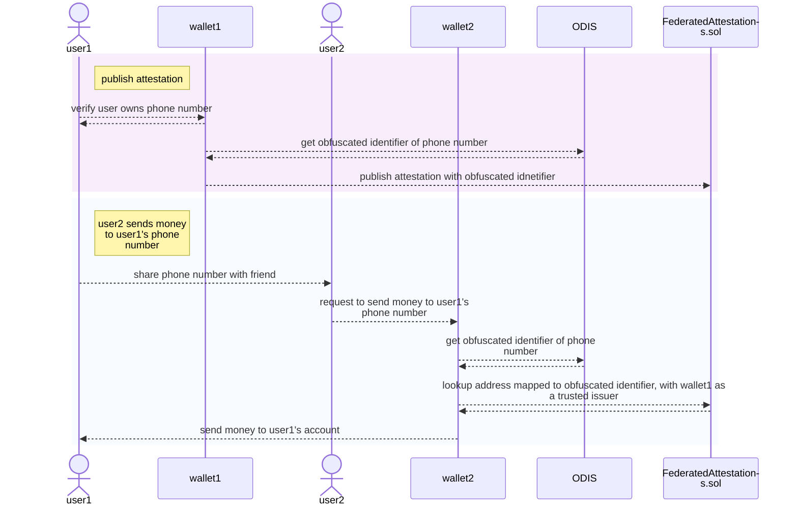

# Attestations Protocol

The goals of this attestation protocol are to increase adoption of identity mappings, and encourage network effects of shared cross-application identity attestations. To this end, we have made it possible for anyone to permissionlessly become an issuer of attestations.

## Table of contents

- [Attestations Protocol](#attestations-protocol)
  - [Table of contents](#table-of-contents)
  - [Verification](#verification)
  - [User Flows](#user-flows)
    - [Register phone number](#register-phone-number)
    - [Look up phone number](#look-up-phone-number)
    - [Send money to user on a different wallet](#send-money-to-user-on-a-different-wallet)
  - [Interacting with the protocol](#interacting-with-the-protocol)
    - [Issuer Signers](#issuer-signers)
    - [Registration](#registration)
      - [Registering identifiers as the issuer](#registering-identifiers-as-the-issuer)
      - [Registering identifiers with signer](#registering-identifiers-with-signer)
    - [Lookups](#lookups)
  - [Smart Contract Addresses](#smart-contract-addresses)
    - [Mainnet](#mainnet)
    - [Alfajores](#alfajores)

## Verification

Issuers have the freedom to decide how to verify that the user actually owns their identifier. After verification, issuers register the mapping as an attestation to the [on-chain smart contract registry](https://github.com/celo-org/celo-monorepo/blob/master/packages/protocol/contracts/identity/FederatedAttestations.sol). Attestations are stored under the issuer that registered them. When looking up attestations, we then have to decide which issuers are trusted.

## User Flows

<details>
<summary><b>Participants Glossary</b></summary>

| Participant | Description |
|-----------|--------|
| user | User that owns the off-chain identifier and account
| issuer | Anyone who is verifying identifiers and creating on-chain attestations, this will most likely be a wallet  
| Oblivious Decentralised Identity Service (ODIS) | An API that produces secrets used for obfuscating the identifiers, more details [here](privacy.md) |
| `FederatedAttestations.sol` | On-chain registry of attestation mappings between identifiers and addresses |
| `OdisPayments.sol` |  Smart contract used to pay for [ODIS quota](privacy.md#rate-limit) |

</details>

<!-- Here is a visual overview:

 -->

### Register phone number

The user provides their phone number to the application, who is acting as an issuer. The application verifies that the user has ownership of their phone number. Then the application queries ODIS for the obfuscated identifier of the phone number. Using the obfuscated identifier, the application, as an issuer, registers the on-chain mapping between the identifier and the user's account address.


### Look up phone number 

The wallet queries ODIS for the obfuscated identifier of the phone number. Using the obfuscated identifier, the wallet looks up the on-chain registry to see which account is mapped to that identifier, specifying itself as the trusted issuer.


### Send money to user on a different wallet

Wallet 1 registers user 1's phone number, as [described above](#register-phone-number).

User 2, who has an account with wallet 2, would like to send money to their friend, user 1. Knowing user 1's phone number, they share it with wallet 2. After getting the obfuscated identifier, wallet 2 uses it to look up the account associated with user 1's phone number, as described above, while specifying that they trust wallet 1 as an issuer. Using the associated account found, wallet 2 completes the transaction of sending money from user 2 to user 1.



## Interacting with the protocol

<!-- insert on-chain data schema? -->

### Issuer Signers

We recommend issuers create separate signer keys for the express purpose of signing attestations. This is to avoid using the issuer account for multiple functions. If a signer key is compromised or lost, the issuer can simply rotate its signer keys and update its attestations accordingly. It is possible to authorize multiple signer keys for this role.

The signer key needs to be authorized by the issuer, under the `AttestationSigner` role.

```typescript
import { encodePacked, keccak256 } from 'web3-utils'

const signerRole = keccak256(encodePacked('celo.org/core/attestation'))
await accountsContract.authorizeSigner(signerAddress, signerRole, { from: issuerAddress })
await accountsContract.completeSignerAuthorization(issuerAddress, signerRole, { from: signerAddress })
```

Attestation mappings are indexed by the address of the issuer. The benefit of using the issuer address instead of the signer address is that the issuer address never changes, while the signer key can be rotated or revoked. If a signer key has been compromised, the issuer can then accordingly remove invalid attestations or upload removed attestations.

### Registration

Registering more than one attestation with the same (identifier, issuer, account) is not allowed and will cause the transaction to revert. A maximum of 20 accounts can be associated with each identifier, and a maximum of 20 identifiers can be associated with each account.

#### Registering identifiers as the issuer

For convenience, the issuer can be its own signer, in which case the attestation is directly registered.

```typescript
await federatedAttestationsContract
  .registerAttestationAsIssuer(
      obfuscatedIdentifier,
      accountAddress,
      verificationTimestamp
  ).send({ from: issuerAddress })
```

#### Registering identifiers with signer

Signers must sign an [EIP712 typed data](https://eips.ethereum.org/EIPS/eip-712) object representing the attestation.

```ts
import { ensureLeading0x } from '@celo/base'
import { generateTypedDataHash } from '@celo/utils/src/sign-typed-data-utils'
import { parseSignatureWithoutPrefix } from '@celo/utils/src/signatureUtils'

const getSignatureForAttestation = async (
  identifier: string,
  issuer: string,
  account: string,
  issuedOn: number,
  signer: string,
  chainId: number,
  contractAddress: string
) => {
  const typedData =  {
    types: {
      EIP712Domain: [
        { name: 'name', type: 'string' },
        { name: 'version', type: 'string' },
        { name: 'chainId', type: 'uint256'}, 
        { name: 'verifyingContract', type: 'address'}, 
      ],
      OwnershipAttestation: [
          { name: 'identifier', type: 'bytes32' },
          { name: 'issuer', type: 'address'},
          { name: 'account', type: 'address' },
          { name: 'signer', type: 'address' },
          { name: 'issuedOn', type: 'uint64' },
      ],
    },
    primaryType: 'OwnershipAttestation',
    domain: {
      name: 'FederatedAttestations',
      version: '1.0',
      chainId,
      verifyingContract: contractAddress
    },
    message:{ 
      identifier,
      issuer,
      account, 
      signer, 
      issuedOn
    }
  }

  const signature = await new Promise<string>((resolve, reject) => {
    web3.currentProvider.send(
      {
        method: 'eth_signTypedData',
        params: [signer, typedData],
      },
      (error, resp) => {
        if (error) {
          reject(error)
        } else {
          resolve(resp.result)
        }
      }
    )
  })

  const messageHash = ensureLeading0x(generateTypedDataHash(typedData).toString('hex'))
  const parsedSignature = parseSignatureWithoutPrefix(messageHash, signature, signer)
  return parsedSignature
}
```

Anyone who has posession of this signature can register the attestation to the on-chain registry.

```typescript
const {v,r,s} = getSignatureForAttestation(
    obfuscatedIdentifier, 
    issuerAddress, 
    accountAddress, 
    verificationTimestamp, 
    signerAddress, 
    chainId, 
    federatedAttestationsContract.address
)
await federatedAttestationsContract.registerAttestation(
    obfuscatedIdentifier,
    issuerAddress,
    accountAddress,
    signerAddress,
    verificationTimestamp,
    v,
    r,
    s
).send()
```

### Lookups

Given a list of issuers that you trust, you can look up the accounts they have mapped to an identifier, and the identifiers they have mapped to an account.

```typescript
const attestations = await federatedAttestationsInstance
    .lookupAttestations(obfuscatedIdentifier, [trustedIssuer1Address, trustedIssuer2Address])
    .call();

// Returns: accounts, signers, issuedOns, and publishedOns represent attestations, where all the elements of the same index constitute one attestation object. countsPerIssuer lists the number of attestations belonging to each issuer passed into the function (ex: countsPerIssuer = [2,3] means that elements 0-1 of the other arrays represent attestations issued by trustedIssuer1 and elements 2-4 of the other arrays represent attestations issued by trustedIssuer2)
// {
//     countsPerIssuer: string[]
//     accounts: Address[]
//     signers: Address[]
//     issuedOns: string[]
//     publishedOns: string[]
// }
console.log(attestations.accounts)

const attestations = await federatedAttestationsInstance
    .lookupIdentifiers(accountAddress, [trustedIssuer1Address, trustedIssuer2Address])
    .call();
    
// Returns:
// {
//     countsPerIssuer: string[]
//     identifiers: string[]
// }
```

## Smart Contract Addresses

### Mainnet

- [FederatedAttestations](https://github.com/celo-org/celo-monorepo/blob/master/packages/protocol/contracts/identity/FederatedAttestations.sol):
  - [`0x0aD5b1d0C25ecF6266Dd951403723B2687d6aff2`](https://explorer.celo.org/address/0x0aD5b1d0C25ecF6266Dd951403723B2687d6aff2/transactions) (proxy)
  - [`0x76A4daaC43912A443f098D413DED2Cb7A153EA85`](https://explorer.celo.org/address/0x76A4daaC43912A443f098D413DED2Cb7A153EA85/transactions) (implementation)
- [OdisPayments](https://github.com/celo-org/celo-monorepo/blob/master/packages/protocol/contracts/identity/OdisPayments.sol):
  - [`0xAE6B29f31B96e61DdDc792f45fDa4e4F0356D0CB`](https://explorer.celo.org/address/0xAE6B29f31B96e61DdDc792f45fDa4e4F0356D0CB/transactions) (proxy)
  - [`0x9Ea5E9b9B48a72325D59B3EBA147F42b1b14BF78`](https://explorer.celo.org/address/0x9Ea5E9b9B48a72325D59B3EBA147F42b1b14BF78/transactions) (implementation)
- [Escrow](https://github.com/celo-org/celo-monorepo/blob/master/packages/protocol/contracts/identity/Escrow.sol):
  - [`0xf4Fa51472Ca8d72AF678975D9F8795A504E7ada5`](https://explorer.celo.org/address/0xf4Fa51472Ca8d72AF678975D9F8795A504E7ada5/transactions) (proxy)
  - [`0xcC4E6caBe88EBb7FCCB40d862bf1C3a89f88e835`](https://explorer.celo.org/address/0xcC4E6caBe88EBb7FCCB40d862bf1C3a89f88e835/transactions) (implementation)
- [Accounts](https://github.com/celo-org/celo-monorepo/blob/master/packages/protocol/contracts/common/Accounts.sol#L244):
  - [`0x7d21685C17607338b313a7174bAb6620baD0aaB7`](https://explorer.celo.org/address/0x7d21685C17607338b313a7174bAb6620baD0aaB7/transactions) (proxy)
  - [`0xc72cf67B173c3d92564EB653d9bF73392825ADCE`](https://explorer.celo.org/address/0xc72cf67B173c3d92564EB653d9bF73392825ADCE/transactions) (implementation)

### Alfajores

- [FederatedAttestations](https://github.com/celo-org/celo-monorepo/blob/master/packages/protocol/contracts/identity/FederatedAttestations.sol):
  - [`0x70F9314aF173c246669cFb0EEe79F9Cfd9C34ee3`](https://alfajores-blockscout.celo-testnet.org/address/0x70F9314aF173c246669cFb0EEe79F9Cfd9C34ee3/transactions) (proxy)
  - [`0x926E88a280902Bfff5047693B9CeAfdb9F4d5095`](https://explorer.celo.org/alfajores/address/0x926E88a280902Bfff5047693B9CeAfdb9F4d5095/transactions) (implementation)
- [OdisPayments](https://github.com/celo-org/celo-monorepo/blob/master/packages/protocol/contracts/identity/OdisPayments.sol):
  - [`0x645170cdB6B5c1bc80847bb728dBa56C50a20a49`](https://explorer.celo.org/alfajores/address/0x645170cdB6B5c1bc80847bb728dBa56C50a20a49/transactions) (proxy)
  - [`0x72eAC1F0518213Ad405560eFd3fB647FbDAdb703`](https://explorer.celo.org/alfajores/address/0x72eAC1F0518213Ad405560eFd3fB647FbDAdb703/transactions) (implementation)
- [Escrow](https://github.com/celo-org/celo-monorepo/blob/master/packages/protocol/contracts/identity/Escrow.sol):
  - [`0xb07E10c5837c282209c6B9B3DE0eDBeF16319a37`](https://alfajores-blockscout.celo-testnet.org/address/0xb07E10c5837c282209c6B9B3DE0eDBeF16319a37/transactions) (proxy)
  - [`0xa34117B48313dE0093d599720998415bAb5FD61d`](https://explorer.celo.org/alfajores/address/0xa34117B48313dE0093d599720998415bAb5FD61d/transactions) (implementation)
- [Accounts](https://github.com/celo-org/celo-monorepo/blob/master/packages/protocol/contracts/common/Accounts.sol#L244):
  - [`0xed7f51A34B4e71fbE69B3091FcF879cD14bD73A9`](https://explorer.celo.org/alfajores/address/0xed7f51A34B4e71fbE69B3091FcF879cD14bD73A9/transactions) (proxy)
  - [`0x893120B08e86ACF40998BB16880ACB0B8efC25F0`](https://explorer.celo.org/alfajores/address/0x893120B08e86ACF40998BB16880ACB0B8efC25F0/transactions) (implementation)
